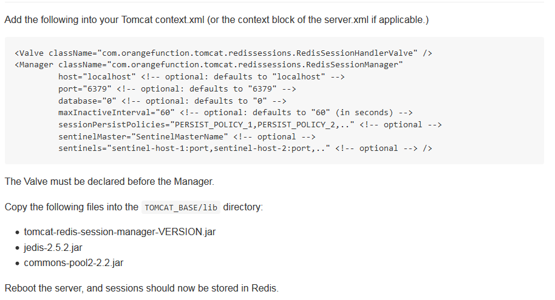
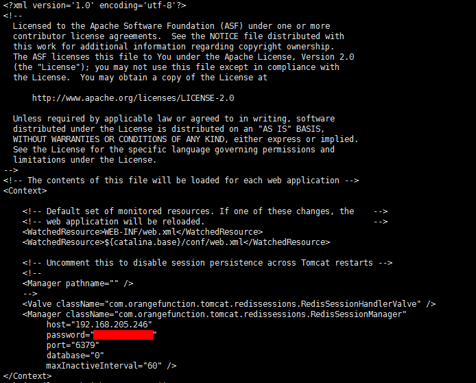
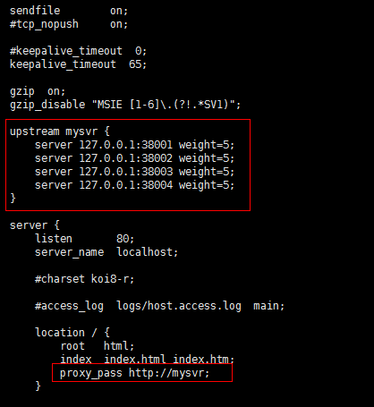

## tomcat7依赖redis配置集群实现session共享

tomcat实现集群有很多种方式，接下来给大家介绍的是如何使用redis实现session共享。  特别说明本篇只适用于tomcat7及一下版本。后续会推出tomcat7及以上版本解决方案。

## 1. redis安装配置  

redis安装起来也特别简单，此篇略过。

## 2. tomcat安装配置

也略过吧

## 3. 获取tomcat-redis-session-manager并打包  

我们需要依赖一个由美国的[James Coleman](https://github.com/jcoleman)同学编写的[tomcat-redis-session-manager](https://github.com/jcoleman/tomcat-redis-session-manager)项目，该项目是用gradle构建的。所以你需要用到gradle。
  
1. 安装gradle  
    gradle官网地址：[http://gradle.org/](http://gradle.org/)  
    gradle下载页面：[http://gradle.org/gradle-download/](http://gradle.org/gradle-download/)  
    gradle2.9完整包下载地址：[https://services.gradle.org/distributions/gradle-2.9-all.zip](https://services.gradle.org/distributions/gradle-2.9-all.zip)  
    下载完成后，解压并配置环境变量：  
    
    首先打开环境变量配置文件  
    
        sudo gedit /etc/profile  
    
    在文件末尾添加nodejs的环境配置  
    
        export GRADLE_HOME=/xxx/xxx/xxxx/gradle-2.9  
        export PATH=原PATH地址;%GRADLE_HOME%/bin   
    
    输入命令测试gradle：`gradle -v` 显示版本即可  
     
2. 用gradle编译tomcat-session-manager    
    首先你需要在github上将该项目clone下来： `clone https://github.com/jcoleman/tomcat-redis-session-manager.git`  
    然后在该目录输入命令: `gradle build` 如果你想查看gradle构建中遇到的详细错误信息栈则添加参数--stacktrace：`gradle build --stacktrace`   
    结果报出错误: No such property: sonatypeUsername for class: org.gradle.api.publication.maven.internal.deployer.DefaultGroovyMavenDeployer  
      
    那么请在signing节点中添加required = false以及删掉或注释掉build.gradle文件中的sonatype的repository代码即可  
      
    再次运行`gradle build --stacktrace` 构建成功，然后打包的jar会放到build/libs目录下  
      
    此时只需要将tomcat-redis-session-manager-2.0.0.jar以及另外两个依赖包：jedis-2.5.2.jar，commons-pool2-2.2.jar一并拷入tomcat的lib目录下即可（依赖包可以在gradle的用户目录下找到）   
     
3. 配置tomcat对redis的依赖  
    James在文档中是这么说的：  
      
    
    所以我们只需要在所有的tomcat/conf/context.xml中加入配置即可  
      
    
## 4. 使用nginx做分发  
  
由于没有物理环境来做集群，所以我在一台机器上启动了多个tomcat绑定不同的端口来模拟多台服务器。  

## 5. 最后

然后James说：Reboot the server, and sessions should now be stored in Redis.

重启服务，然后session就能自动保存到redis缓存中。

可能通过gradle编译其实挺麻烦的，所以呢我传了一份jar包和配置文件到百度网盘，如果闲麻烦就直接下载吧：

http://pan.baidu.com/s/1qWXgNTy