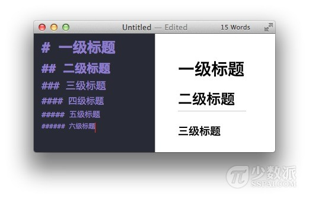
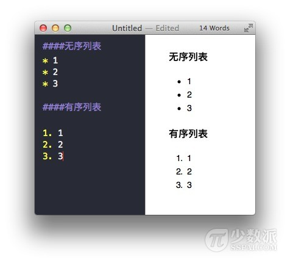
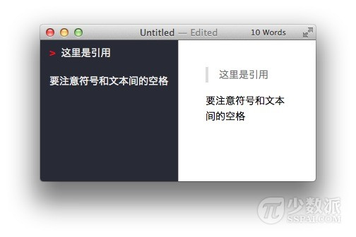
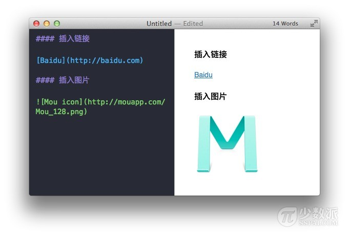

# 介绍
Markdown 是一种轻量级的「标记语言」，它的优点很多，目前也被越来越多的写作爱好者，撰稿者广泛使用。看到这里请不要被「标记」、「语言」所迷惑，Markdown 的语法十分简单。常用的标记符号也不超过十个，这种相对于更为复杂的HTML 标记语言来说，Markdown 可谓是十分轻量的，学习成本也不需要太多，且一旦熟悉这种语法规则，会有一劳永逸的效果
# 语法
### 兼容HTML
Markdown 语法的目标是：成为一种适用于网络的书写语言。  

Markdown 不是想要取代 HTML，甚至也没有要和它相近，它的语法种类很少，只对应 HTML 标记的一小部分。Markdown 的构想不是要使得 HTML 文档更容易书写。在我看来， HTML 已经很容易写了。Markdown 的理念是，能让文档更容易读、写和随意改。HTML 是一种发布的格式，Markdown 是一种书写的格式。就这样，Markdown 的格式语法只涵盖纯文本可以涵盖的范围。  

不在 Markdown 涵盖范围之内的标签，都可以直接在文档里面用 HTML 撰写。不需要额外标注这是 HTML 或是 Markdown；只要直接加标签就可以了。  

要制约的只有一些 HTML 区块元素――比如 &lt;div&gt;、&lt;table&gt;、&lt;pre&gt;、&lt;p&gt; 等标签，必须在前后加上空行与其它内容区隔开，还要求它们的开始标签与结尾标签不能用制表符或空格来缩进。Markdown 的生成器有足够智能，不会在 HTML 区块标签外加上不必要的 &lt;p&gt; 标签。  

请注意，在 HTML 区块标签间的 Markdown 格式语法将不会被处理。比如，你在 HTML 区块内使用 Markdown 样式的*强调*会没有效果。  

HTML 的区段（行内）标签如 &lt;span&gt;、&lt;cite&gt;、&lt;del&gt; 可以在 Markdown 的段落、列表或是标题里随意使用。依照个人习惯，甚至可以不用 Markdown 格式，而直接采用 HTML 标签来格式化。举例说明：如果比较喜欢 HTML 的 &lt;a&gt; 或 &lt;img&gt; 标签，可以直接使用这些标签，而不用 Markdown 提供的链接或是图像标签语法。  
和处在 HTML 区块标签间不同，Markdown 语法在 HTML 区段标签间是有效的。
### 特殊字符转换
在 HTML 文件中，有两个字符需要特殊处理： &lt; 和 &amp; 。 &lt; 符号用于起始标签，&amp; 符号则用于标记 HTML 实体，如果你只是想要显示这些字符的原型，你必须要使用实体的形式，像是 &amplt; 和 &amp;amp;。

&amp; 字符尤其让网络文档编写者受折磨，如果你要打「AT&amp;T」 ，你必须要写成「AT&amp;amp;T」。而网址中的 & 字符也要转换。比如你要链接到:    
>    `http://images.google.com/images?num=30&amp;q=larry+bird`  

你必须要把网址转换写为：  
>    `http://images.google.com/images?num=30&amp;amp;q=larry+bird`  

才能放到链接标签的 href 属性里。不用说也知道这很容易忽略，这也可能是 HTML 标准检验所检查到的错误中，数量最多的。  

Markdown 让你可以自然地书写字符，需要转换的由它来处理好了。如果你使用的 &amp; 字符是 HTML 字符实体的一部分，它会保留原状，否则它会被转换成 &amp;amp;。    
所以你如果要在文档中插入一个版权符号 ©，你可以这样写：  
>    `&copy;`  

Markdown 会保留它不动。而若你写：    
>    `AT&T`  

Markdown 就会将它转为：  
>    `AT&amp;T`

类似的状况也会发生在 &lt; 符号上，因为 Markdown 允许 兼容 HTML ，如果你是把 &lt; 符号作为 HTML 标签的定界符使用，那 Markdown 也不会对它做任何转换，但是如果你写：    
>    `4 < 5`  

Markdown 将会把它转换为：  
>    `4 &lt; 5`

不过需要注意的是，code 范围内，不论是行内还是区块， &lt; 和 &amp; 两个符号都一定会被转换成 HTML 实体，这项特性让你可以很容易地用 Markdown 写 HTML code （和 HTML 相对而言， HTML 语法中，你要把所有的 &lt; 和 & 都转换为 HTML 实体，才能在 HTML 文件里面写出 HTML code。）  
### 区块元素
一个 Markdown 段落是由一个或多个连续的文本行组成，它的前后要有一个以上的空行（空行的定义是显示上看起来像是空的，便会被视为空行。比方说，若某一行只包含空格和制表符，则该行也会被视为空行）。普通段落不该用空格或制表符来缩进。

「由一个或多个连续的文本行组成」这句话其实暗示了 Markdown 允许段落内的强迫换行（插入换行符），这个特性和其他大部分的 text-to-HTML 格式不一样（包括 Movable Type 的「Convert Line Breaks」选项），其它的格式会把每个换行符都转成 &lt;br /&gt; 标签。

如果你确实想要依赖 Markdown 来插入 &lt;br /&gt; 标签的话，在插入处先按入两个以上的空格然后回车。

的确，需要多费点事（多加空格）来产生 &lt;br /&gt; ，但是简单地「每个换行都转换为 &lt;br /&gt;」的方法在 Markdown 中并不适合， Markdown 中 email 式的 区块引用 和多段落的 列表 在使用换行来排版的时候，不但更好用，还更方便阅读。
### 标题
  
在行首插入 1 到 6 个 # ，对应到标题 1 到 6 阶，例如：  
>    `# 这是 H1`  
    `## 这是 H2`  
    `###### 这是 H6`    

以此类推，总共六级标题，建议在 `#` 号后加一个空格  

###列表
Markdown 支持有序列表和无序列表。  


无序列表使用星号、加号或是减号作为列表标记：  
>   `*   Red`  
   `*   Green`  
   `*   Blue`  

等同于：  
>   `+   Red`  
   `+   Green`  
   `+   Blue`  

也等同于：  
>   `-   Red`  
   `-   Green`  
   `-   Blue`  
   
有序列表则使用数字接着一个英文句点：  
>    `1.  Bird`  
    `2.  McHale`  
    `3.  Parish`  

###引用
  
Markdown 标记区块引用是在每行的最前面加上 > ：  
> `>`这是引用的内容  
> `>`这依然是引用的内容  

Markdown 也允许你偷懒只在整个段落的第一行最前面加上 > ：
> `>`引用的第一行  
引用的第二行

###图片与链接
插入链接与插入图片的语法很像，区别在一个 ! 号  


也可以是当前目录下的图片或连接:  
> `[Markdown语法](./Others/1.Markdown语法.md)`  
> ``  

###粗体与斜体
Markdown 的粗体和斜体也非常简单，用两个 * 包含一段文本就是粗体的语法，用一个 * 包含一段文本就是斜体的语法。  
> `**这是粗体**`  
`*这是斜体*`

显示结果为:  
> **这是粗体**  
*这是斜体*  

###表格
用横线和竖线构造一个表格格式,用冒号标志对齐方式:  

<pre><code>| Tables        | Are           | Cool  |</code>
<code>| ------------- |:-------------:| -----:|</code>
<code>| col 3 is      | right-aligned | $1600 |</code>
<code>| col 2 is      | centered      |   $12 |</code>
<code>| zebra stripes | are neat      |    $1 |</code></pre>

结果为:

| Tables        | Are           | Cool  |  
| ------------- |:-------------:| -----:|  
| col 3 is      | right-aligned | $1600 |  
| col 2 is      | centered      |   $12 |  
| zebra stripes | are neat      |    $1 |  

###代码框
要在 Markdown 中建立代码区块很简单，只要简单地缩进 4 个空格或是 1 个制表符就可以，例如，下面的输入：  

        <div>
            <span>hehe</span>
        </div>
        
        public static void main(String args[]) {
            System.out.println("Hello World!!!");
        }

其结果为:  

    <div>
        <span>hehe</span>
    </div>

    public static void main(String args[]) {
        System.out.println("Hello World!!!");
    }

也可以使用反撇号 `` ` `` 来标志代码块:  
  

编写如下代码:  
    `var obj = {name: "zhangsan", gender: "male"};`  
其结果为:  
`var obj = {name: "zhangsan", gender: "male"};`  

如果代码中需要用到 `` ` ``号,则首尾用多个 `` ` ``号来包含代码块(首尾个数一致),如:  
    ``` `` select `name`,`gender` from `user` `` ```  
其结果为:  
`` select `name`,`gender` from `user` ``
    
###分割线
你可以在一行中用三个以上的星号、减号、底线来建立一个分隔线，行内不能有其他东西。你也可以在星号或是减号中间插入空格。下面每种写法都可以建立分隔线：  
    * * *  
    ***  
    *****  
    - - -  
    ---------------------------------------  
    
其结果为:  
* * *
***
*****
- - -
---------------------------------------

###反斜杠
Markdown 可以利用反斜杠来插入一些在语法中有其它意义的符号，例如：如果你想要用星号加在文字旁边的方式来做出强调效果（但不用 &lt;em&gt; 标签），你可以在星号的前面加上反斜杠：  
> \*literal asterisks\*  

Markdown 支持以下这些符号前面加上反斜杠来帮助插入普通的符号：
    \   反斜线  
    `   反引号  
    *   星号  
    _   底线  
    {}  花括号  
    []  方括号  
    ()  括弧  
    #   井字号  
    +   加号  
    -   减号  
    .   英文句点  
    !   惊叹号  
    
#相关资料:
####[Markdown快速入门](http://wowubuntu.com/markdown/basic.html)  
####[Markdown语法完整版](http://wowubuntu.com/markdown/index.html)  
####[Markdown繁体版](http://markdown.tw/)  
####[认识与入门 Markdown](http://sspai.com/25137)  